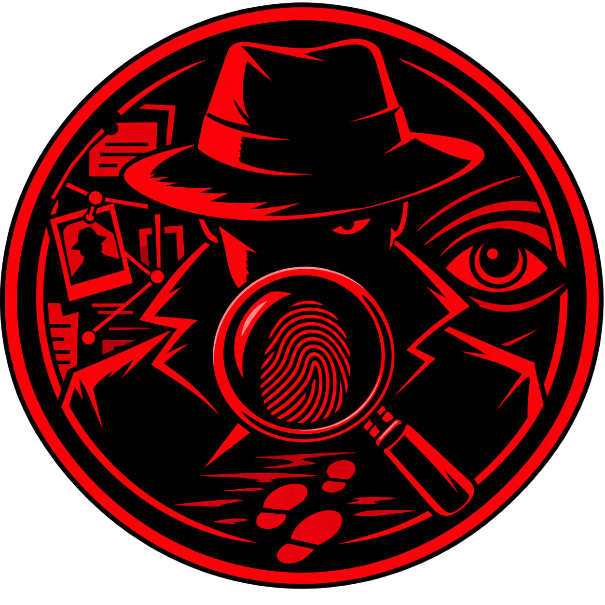

<div align="center">



# THE MISSING HOUR

### **Every clue has a time. Every suspect has a story.**

A narrative-driven detective investigation game where **you listen, examine, connect, and deduce.**

<br>

[**Download v1.0.0**](https://github.com/FunLogic-Studios/The-Missing-Hour/releases/download/v1.0.0/The-Missing-Hour-setup.zip) · [Report a Bug](../../issues/new/choose)

</div>

---

## ◼ THE CASE

A case rarely gives you everything you need.

You will receive a briefing, a list of suspects, and a limited number of opportunities to investigate. From there, the case is yours.

Search through recovered evidence.
Read documents.
Listen to recordings.
Study surveillance footage.
Compare statements.
Reconstruct the timeline.
Connect what doesn't seem connected.

Then make your accusation.

**Choose carefully.**

You may not have enough investigation resources to examine everything.

---

## ◼ HOW TO PLAY

```text
SELECT CASE
     ↓
READ BRIEFING
     ↓
BEGIN INVESTIGATION
     ↓
SEARCH FOR EVIDENCE
     ↓
READ / LISTEN / EXAMINE
     ↓
REVIEW SUSPECTS
     ↓
RECONSTRUCT TIMELINE
     ↓
CONNECT EVIDENCE
     ↓
FORM YOUR THEORY
     ↓
MAKE YOUR DEDUCTION
```

The game does not expect you to simply find a highlighted answer.

**Pay attention to details.**

A timestamp may matter.

A statement may contradict another statement.

A recording may reveal something that a document doesn't.

A seemingly insignificant clue may change the entire case.

---

## ◼ INVESTIGATION SYSTEM

### Evidence

Discover and examine different forms of evidence, including:

* Documents
* Surveillance images
* Audio recordings
* Reports
* Messages
* Physical evidence
* Other case materials

Once discovered, evidence remains available for review.

### Suspects

Study each suspect's:

* Background
* Relationship to the victim
* Statements
* Alibi
* Possible motive
* Connections to the evidence

No suspect is automatically marked as guilty.

### Timeline

Reconstruct the sequence of events and compare it against the information found during the investigation.

Look for:

* Contradictions
* Impossible timings
* Missing periods
* Suspicious movements
* Conflicting statements

### Investigation Board

Build your own theory by connecting pieces of evidence.

The board represents **your reasoning**, not the game's answer.

### Investigator Notes

Write down anything you consider important.

Record:

* Suspicious details
* Important times
* Contradictions
* Suspect theories
* Evidence connections

---

## ◼ LIMITED INVESTIGATION

You do not have unlimited opportunities.

Each case provides a predetermined number of investigation resources.

```text
CLUES REMAINING
      6 / 8
```

Every investigation decision matters.

You may discover a crucial piece of evidence.

You may investigate something irrelevant.

You may follow the wrong lead.

**The case will not wait forever.**

---

## ◼ FINAL DEDUCTION

When you believe you have solved the case, enter the final deduction.

Select the suspect you believe is responsible and submit your conclusion.

Your deduction is evaluated against the actual case.

### Correct

The case is solved.

You receive the final reconstruction and the evidence behind the solution.

### Incorrect

Your theory was wrong.

The case reveals what you missed.

---

## ◼ VERSION 1.0

**The Missing Hour — Version 1.0.0**

Initial release featuring:

* Case selection
* Case briefings
* Investigation workstation
* Limited clue system
* Evidence discovery
* Documents
* Audio recordings
* Suspect investigation
* Timeline reconstruction
* Investigation board
* Investigator notes
* Final deduction system
* Persistent local game progress
* Windows desktop application

---

## ◼ RUNNING THE GAME

The Missing Hour is distributed as a Windows desktop application.

Download the latest installer from:

**[GitHub Releases](../../releases/latest)**

Install the game and launch:

```text
The Missing Hour
```

No browser setup or development environment is required for the released version.

---

## ◼ PROJECT

**The Missing Hour** is an original detective game developed by **FunLogic Studios**.

The public repository is intended for:

* Game information
* Release distribution
* Version history
* Bug reporting
* Player feedback

The game's development source code is **not included in this repository**.

---

## ◼ CONTENT & CREDITS

Game assets, music, audio and other third-party materials are used according to their respective licenses and permissions.

Individual asset ownership and licensing may differ from the license covering the repository documentation.

---

<div align="center">

### **THE FILE IS OPEN.**

### **THE CLOCK IS RUNNING.**

**Can you find what happened during the missing hour?**

<br>

**FunLogic Studios**

</div>
